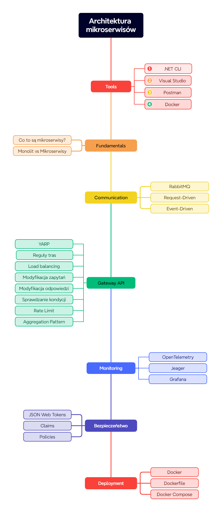

# Przykłady ze szkolenia

## Wprowadzenie

Witaj w repozytorium z materiałami do szkolenia **Architektura mikroserwisów z wykorzystaniem .NET**.

Do rozpoczęcia tego kursu potrzebujesz następujących rzeczy:

1. [.NET 8 SDK](https://dotnet.microsoft.com/en-us/download/dotnet/9.0)
2. [Docker](https://www.docker.com/products/docker-desktop/)

## Przygotowanie
1. Sklonuj repozytorium Git
```
git clone https://github.com/sulmar/sages-dotnet-microservices-...
```
2. Zbuduj
```
cd src
dotnet build
```

## Mapa drogowa

